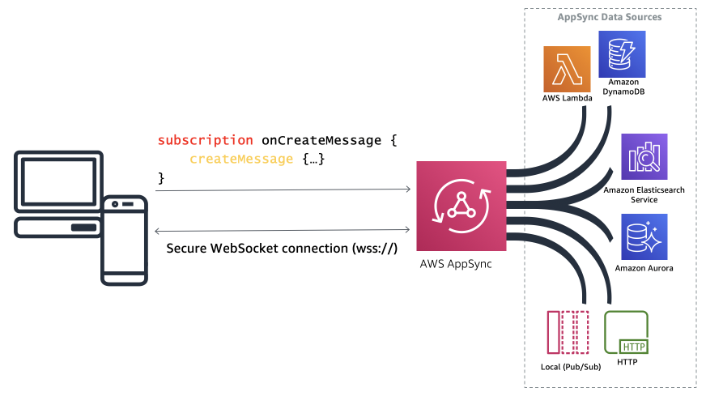

# AWS-APP-SYNC

## Graphql live subscription with aws-amplify and app sync


<br />

```js
type Message @model {
  id: ID!
  message: String!
  roomId: String!
}

type Subscription {
onCreateByRoomId(roomId: String!): Message
@aws_subscribe(mutations: ["createMessage"])
}

```

Distributed under the MIT license. See `LICENSE` for more information.

```sh

Q0.0U0.0A0.0N0.0T0.0U0.0M0 - I0.0N0.0C0.0E0.0P0.0T0.0I0.0O0.0N0.0S0

```
